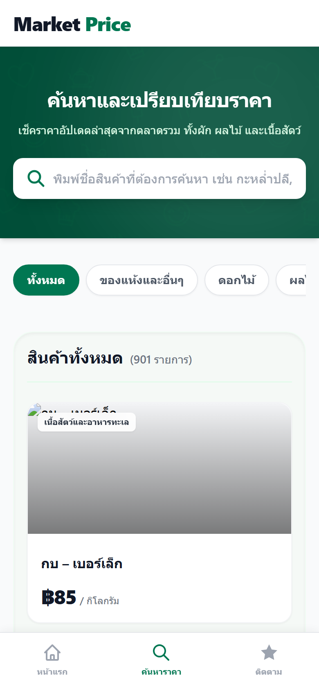
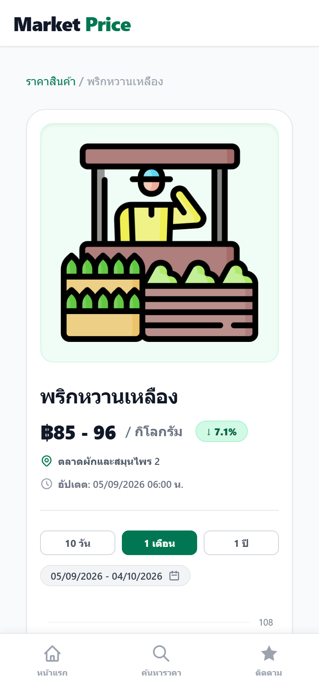
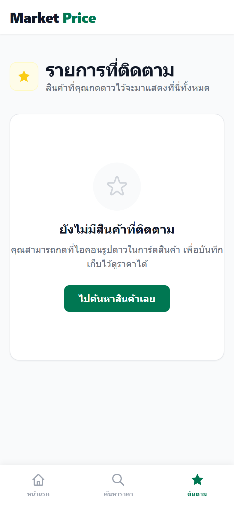

# 🥬 ตลาดรวม (Market Price) - Web Frontend

> แพลตฟอร์มรายงานและเปรียบเทียบราคาสินค้าเกษตรรายวัน ออกแบบเพื่อผู้ประกอบการ พ่อค้าแม่ค้า และผู้บริโภคที่ต้องการข้อมูลราคาสินค้าที่แม่นยำ พร้อมวิเคราะห์แนวโน้มราคาและกราฟความเคลื่อนไหวของตลาดแบบครบวงจร

🌐 **Live Demo (Vercel)**: [https://pricecheck-two.vercel.app](https://pricecheck-two.vercel.app)  
📦 **GitHub Repository**: [https://github.com/PlamGG/PriceCherkMarket](https://github.com/PlamGG/PriceCherkMarket)

---

## 📸 ภาพตัวอย่างระบบ (Screenshots & Responsive Design)

### 🖥️ Desktop Experience

#### 1. หน้าแรก (Homepage & Market Pulse)
แสดงภาพรวมตลาด สินค้าผันผวนประจำวันแยกตามฝั่งราคาปรับลง (น่าซื้อ) / ปรับขึ้น และแนวโน้มราคารายหมวดหมู่


#### 2. หน้าค้นหาและเปรียบเทียบราคา (Price & Search)
ค้นหาด้วยชื่อสินค้า กรองหมวดหมู่ผ่าน Sidebar แสดงราคาเฉลี่ย สูงสุด-ต่ำสุด พร้อมสถานะราคาล่าสุด


#### 3. หน้ารายละเอียดสินค้า (Wholesale Board & Interactive Chart)
ดูกราฟแนวโน้มราคาย้อนหลัง ตารางบันทึกราคา 7 วันแบบ High-Contrast Wholesale Board และสินค้าที่เกี่ยวข้อง


#### 4. หน้ารายการสินค้าที่ติดตาม (Watchlist)
บันทึกสินค้าที่สนใจผ่านระบบ LocalStorage เพื่อตรวจเช็คความเปลี่ยนแปลงราคาได้ทันที


---

### 📱 Mobile Experience (100% Fully Responsive)

รองรับการใช้งานบนสมาร์ทโฟนทุกขนาดหน้าจออย่างสมบูรณ์แบบ พร้อม **Bottom Navigation Bar** แบบ Fixed ใช้งานง่ายด้วยมือเดียว และระบบเลื่อนการ์ดแนวนอน (Touch Swipe)

| หน้าแรก (Home) | ค้นหาราคา (Price) | รายละเอียด (Detail) | รายการติดตาม (Watchlist) |
| :---: | :---: | :---: | :---: |
|  |  |  |  |

---

## 🛠️ เทคโนโลยีหลัก (Tech Stack)

- **Frontend Framework**: [Nuxt 3](https://nuxt.com/) (Vue 3, Composition API, Vite)
- **Styling**: [Tailwind CSS](https://tailwindcss.com/) (Custom Wholesale Data Theme & Mobile-first Breakpoints)
- **Backend & Database**: [Supabase](https://supabase.com/) via `@nuxtjs/supabase`
- **Data Visualization**: Native Reactive SVG & [Chart.js](https://www.chartjs.org/)
- **State Management & Caching**: Nuxt 3 `useState` + In-memory Composable Cache เพื่อลด Database Reads
- **Icons & Graphics**: Heroicons & Handcrafted Clean SVGs

---

## 🚀 สถาปัตยกรรมและการทำงาน (Architecture Highlights)

1. **Wholesale High-Contrast Data Board**:
   - ออกแบบโดยเน้น **Data-Density** และ **Readability** ตัวเลขราคาใช้ฟอนต์ `tabular-nums` เพื่อให้อ่านและเปรียบเทียบง่าย
   - แยกทิศทางราคาชัดเจน: 🟢 สีเขียว (ราคาถูกลง / น่าซื้อ) และ 🔴 สีแดง (ราคาปรับตัวสูงขึ้น)
   - ตารางราคาย้อนหลัง 7 วัน ปรับเป็น Mobile Card อัตโนมัติบนหน้าจอขนาดเล็ก

2. **Mobile-First Responsive Engine**:
   - หน้าจอ `< 768px`: แสดง Bottom Navigation Bar สำหรับการสลับหน้ารวดเร็วด้วยนิ้วโป้ง
   - ตัวกรองหมวดหมู่สลับอัตโนมัติระหว่าง Sidebar (Desktop) และ Horizontal Pill Scroll (Mobile)
   - ระบบจัดเรียง Layout แบบไดนามิก ป้องกันปัญหา Content Overflow ในทุกความกว้างหน้าจอ

3. **Performance & Caching Strategy**:
   - แคชข้อมูลสินค้าระดับ Composable (`useProducts`) เพื่อให้การสลับหน้ารวดเร็วแบบ Instant Load
   - ระบบ Debounced Search สำหรับค้นหาสินค้าแบบ Fuzzy Matching
   - Fallback Image Handling เมื่อรูปภาพจากผู้จัดจำหน่ายไม่พร้อมใช้งาน

---

## 💻 วิธีการติดตั้งและรันโปรเจกต์ (Getting Started)

### ความต้องการของระบบ (Prerequisites)
- [Node.js](https://nodejs.org/) v18.0.0 ขึ้นไป
- [npm](https://www.npmjs.com/) หรือ [pnpm](https://pnpm.io/)

### ขั้นตอนการรัน

1. **ติดตั้ง Dependencies**:
   ```bash
   npm install
   ```

2. **ตั้งค่า Environment Variables**:
   สร้างไฟล์ `.env` ในโฟลเดอร์หลัก และกำหนดค่า Supabase:
   ```env
   SUPABASE_URL=your_supabase_project_url
   SUPABASE_KEY=your_supabase_anon_key
   ```

3. **รัน Development Server**:
   ```bash
   npm run dev
   ```
   เปิดเบราว์เซอร์ไปที่ `http://localhost:3000`

4. **Build สำหรับ Production**:
   ```bash
   npm run build
   ```

---

## 📁 โครงสร้างโฟลเดอร์ (Project Structure)

```text
market/
├── components/          # Vue UI Components (ProductDetail, ProductChart, Search, Today, CategoryTrend, etc.)
├── composables/         # Business Logic & Supabase Queries (useProducts.js)
├── docs/                # เอกสารประกอบและรูปภาพ Screenshots ทั้ง Desktop & Mobile
│   └── screenshots/
├── pages/               # Nuxt File-based Routes (/, /price, /watchlist, /product/[id])
├── public/              # Static Assets (favicon, placeholders)
├── app.vue              # App Root Shell & Layout Setup
├── nuxt.config.ts       # Nuxt Configuration & Route Rules
└── tailwind.config.js   # Tailwind Theme Extensions
```

---

## 📄 License
MIT License
