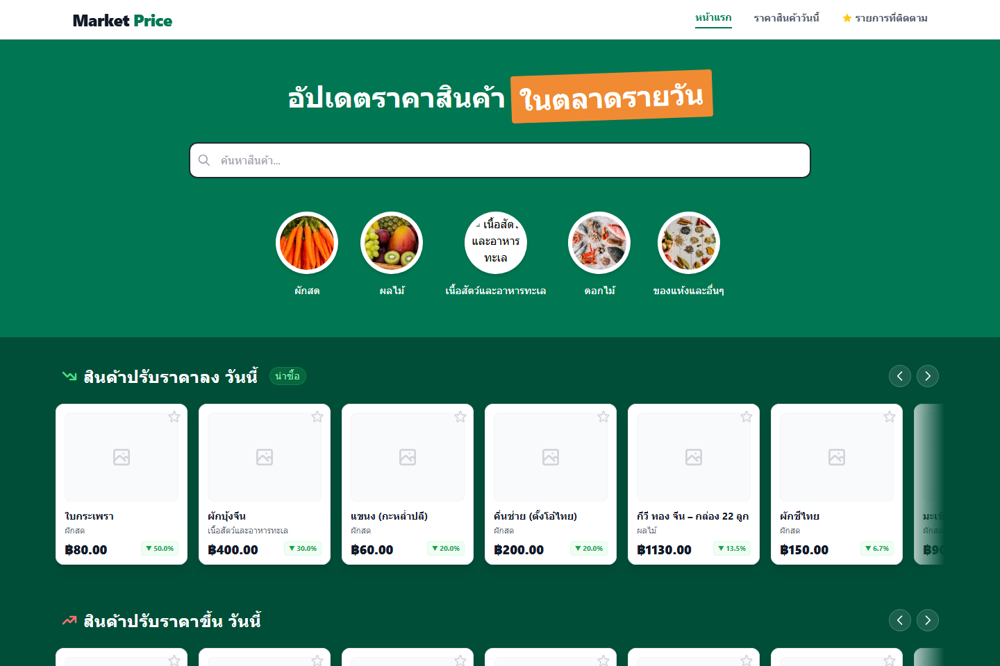
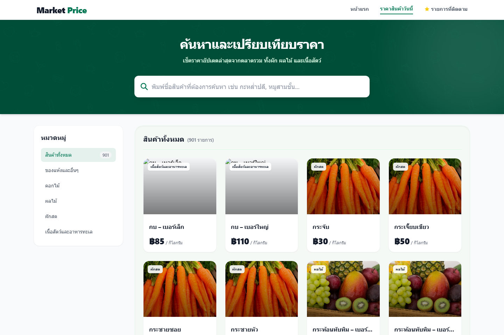
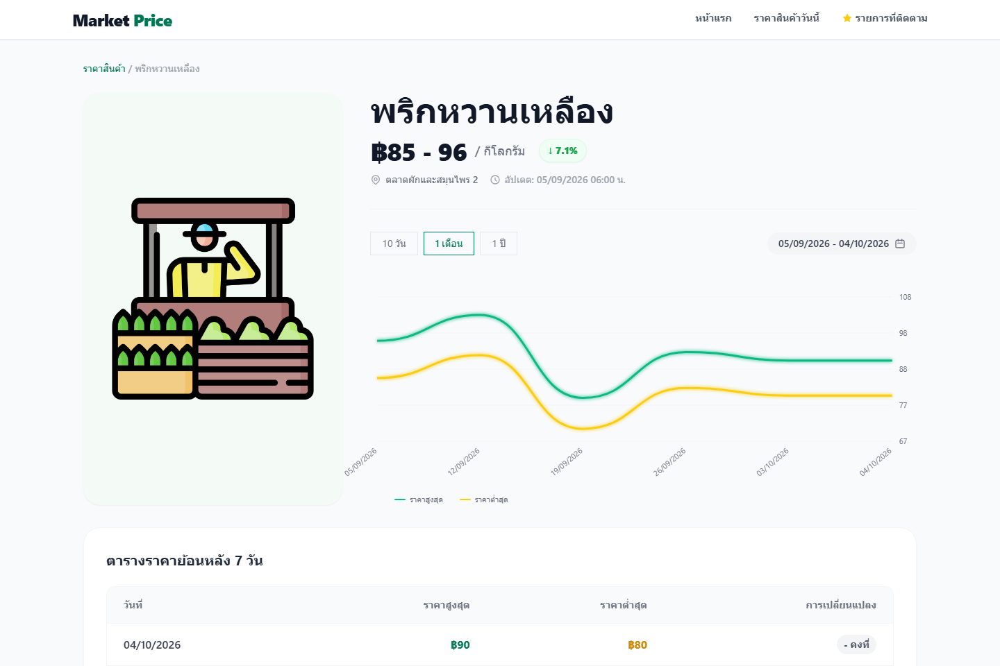
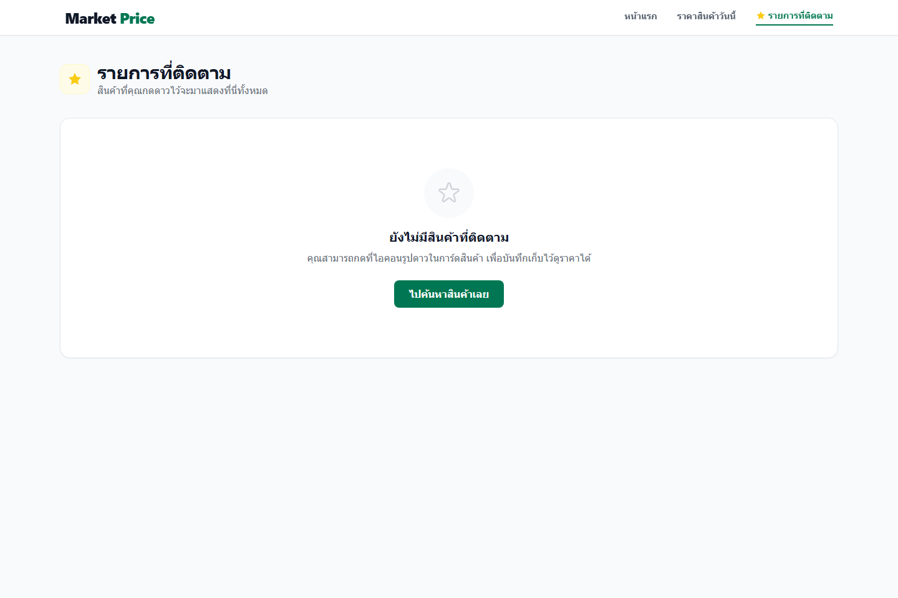
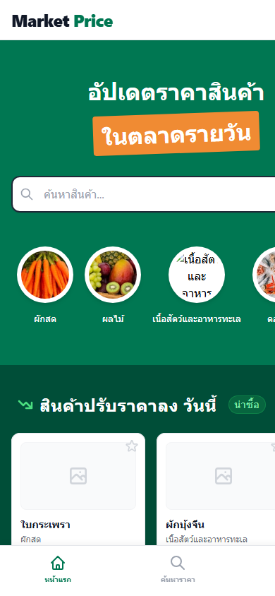

# 🥬 ตลาดรวม (Market Price) - Web Frontend

> ระบบรายงานและเปรียบเทียบราคาสินค้าเกษตรรายวัน ออกแบบเพื่อผู้ประกอบการ พ่อค้าแม่ค้า และผู้บริโภคที่ต้องการข้อมูลราคาสินค้าที่แม่นยำ พร้อมการวิเคราะห์แนวโน้มราคาและความเคลื่อนไหวของตลาด

🌐 **Live Demo (ทดลองใช้งานจริง)**: [https://pricecheck-two.vercel.app](https://pricecheck-two.vercel.app)

---

## 📸 ภาพตัวอย่างหน้าจอ (Screenshots)

### 1. หน้าแรก (Homepage & Market Pulse)
แสดงภาพรวมตลาด สินค้าผันผวนประจำวันแยกตามฝั่งราคาขึ้น/ลง และแนวโน้มราคารายหมวดหมู่


---

### 2. หน้าค้นหาและเปรียบเทียบราคา (Price & Explore)
ค้นหาด้วยชื่อสินค้า กรองตามหมวดหมู่อย่างรวดเร็ว พร้อมแสดงส่วนต่างราคาเทียบกับเมื่อวาน


---

### 3. หน้ารายละเอียดสินค้าและกราฟราคาย้อนหลัง (Product Detail & Trends)
ดูกราฟแนวโน้มราคาย้อนหลัง 7 วัน ตารางเปรียบเทียบราคา และสินค้าที่เกี่ยวข้องในหมวดหมู่เดียวกัน


---

### 4. หน้ารายการสินค้าที่ติดตาม (Watchlist)
บันทึกสินค้าที่สนใจผ่านระบบ LocalStorage เพื่อตรวจเช็คความเปลี่ยนแปลงราคาได้ทันที


---

### 5. รองรับการใช้งานบนมือถือ (Mobile Responsive & App-like Experience)
เมนูแถบล่าง (Bottom Navigation) ใช้งานง่ายด้วยมือเดียว พร้อมการเลื่อนดูข้อมูลแบบ Smooth Horizontal Scroll
<p align="center">
  
</p>

---

## 🛠️ เทคโนโลยีหลัก (Tech Stack)

- **Framework**: [Nuxt 3](https://nuxt.com/) (Vue 3 + Vite)
- **Styling**: [Tailwind CSS](https://tailwindcss.com/)
- **Data & Database**: [Supabase](https://supabase.com/) via `@nuxtjs/supabase`
- **Data Visualization**: [Chart.js](https://www.chartjs.org/) & `vue-chartjs`
- **State Management**: Nuxt 3 `useState` พร้อม In-memory Caching เพื่อลดปริมาณ Database Read
- **Icons**: SVG Native & Heroicons

---

## 🚀 สถาปัตยกรรมและการทำงาน (Architecture Highlights)

1. **Clean Wholesale UI/UX**:
   - การแสดงผลตัวเลขราคาแบบ `tabular-nums` เพื่อความสะดวกในการเปรียบเทียบตัวเลข
   - แยกทิศทางราคาชัดเจน: 🟢 สีเขียว (ราคาถูกลง / น่าซื้อ) และ 🔴 สีแดง (ราคาปรับตัวสูงขึ้น)
   - แถบเมนูด้านล่าง (Bottom Navigation) ปรับตามอุปกรณ์มือถืออัตโนมัติ

2. **ประสิทธิภาพและการดึงข้อมูล (Performance Optimization)**:
   - มีระบบแคชข้อมูล `cached_products` ภายในระดับ Composable เพื่อเลี่ยงการยิง Query ซ้ำซ้อน
   - ค้นหาแบบ Debounced Search ลดภาระการประมวลผลขณะพิมพ์
   - รูปภาพสินค้ามี Fallback Handling อัตโนมัติเมื่อรูปภาพต้นทางเสียหาย

---

## 💻 วิธีการติดตั้งและรันโปรเจกต์ (Getting Started)

### ความต้องการของระบบ (Prerequisites)
- [Node.js](https://nodejs.org/) v18.0.0 ขึ้นไป
- [npm](https://www.npmjs.com/) หรือ [pnpm](https://pnpm.io/)

### ขั้นตอนการรัน

1. **ติดตั้ง Dependencies**:
   ```bash
   npm install
   ```

2. **ตั้งค่า Environment Variables**:
   สร้างไฟล์ `.env` ในโฟลเดอร์หลัก และกำหนดค่า Supabase:
   ```env
   SUPABASE_URL=your_supabase_project_url
   SUPABASE_KEY=your_supabase_anon_key
   ```

3. **รัน Development Server**:
   ```bash
   npm run dev
   ```
   เปิดเบราว์เซอร์ไปที่ `http://localhost:3000`

4. **Build สำหรับ Production**:
   ```bash
   npm run build
   ```

---

## 📁 โครงสร้างโฟลเดอร์ (Project Structure)

```text
market/
├── components/          # Vue UI Components (Search, Today, CategoryTrend, ProductCard, etc.)
├── composables/         # Business Logic & Supabase Queries (useProducts.js)
├── docs/                # เอกสารประกอบและรูปภาพ Screenshots
│   └── screenshots/
├── pages/               # Nuxt File-based Routes (/, /price, /watchlist, /product/[id])
├── public/              # Static Assets (favicon, placeholders)
├── app.vue              # App Root Shell & Layout Setup
├── nuxt.config.ts       # Nuxt Configuration & Route Rules
└── tailwind.config.js   # Tailwind Theme Extensions
```
